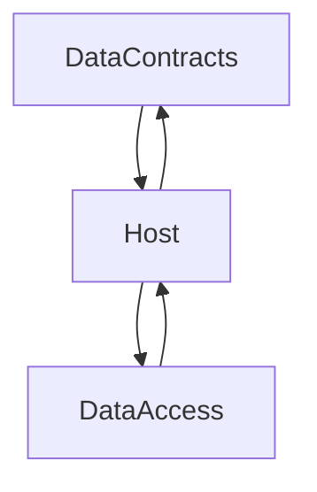

# Overview of the Microservice Template

Here’s a diagram illustrating the structure of this repository:

This structure provides a clean abstraction across different components of the project.

For a practical example of how to use this template, check out the "example-usage" branch.

**Be sure** to update the root namespace to match your project's structure. You can use the appropriate rename-script.* file for your system to handle this update.