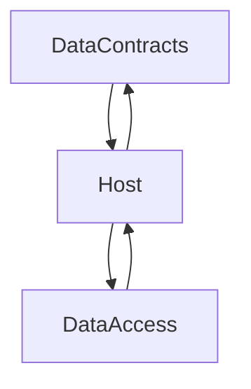

# This is a basic implementation of a microservice template

To run this project, just **restore** the packages and execute the **dotnet run** command

This is a simple example of idea of this repo:

This straucture present good abstraction on projects.
